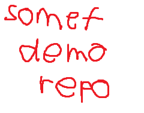

# somef-demo-repo
This repo aims to provide values for each metadata field that SOMEF (v0.9.4) can extract.

# Acknowledgements
I would like to thank my fellow maSMP-Hackathonners for the great vibes and Leyla Jael Castro for organizing it.

# Citation
Please cite this repo as Pronk, T. (2023). *somef-demo-repo: This repo aims to provide values for each metadata field that SOMEF (v0.9.4) can extract* (Version 0.0.1) [Computer software]. https://github.com/tpronk/somef-demo-repo

# Contact
Contact person responsible for maintaining a software component

# Contributors
Here could be a list of contributors to this software component

# Documentation
Where to find additional documentation about a software component.

# Download 
Download instructions included in the repository.

# Executable notebook
Here you find a non-functioning executable notebook in Jupyter on top of Binder: https://mybinder.org/dummy-notebook

# FAQ
Frequently asked questions about a software component

# Identifier
Copied from the [deeprank2 repo](https://github.com/DeepRank/deeprank2)
[](https://zenodo.org/badge/latestdoi/450496579)

# Image
Images used to illustrate the software component.


# Installation instructions
A set of instructions that indicate how to install a target repository

# Invocation
Execution command(s) needed to run a scientific software component. Copied from [https://github.com/MPDL/unibiAPC/](https://github.com/MPDL/unibiAPC/)

```{r, echo=FALSE, results='asis', message = FALSE}\nmy_apc %>% select(institution, euro) %>% \n  group_by(institution) %>% \n  ezsummary::ezsummary(n = TRUE, digits= 0, median = TRUE,\n                       extra = c(\n                         sum = \"sum(., na.rm = TRUE)\",\n                         min = \"min(., na.rm = TRUE)\",\n                         max = \"max(., na.rm = TRUE)\"\n                         )) %>%\n  mutate_all(format, big.mark=',') %>%\n  ezsummary::ezmarkup('...[. (.)]..[. - .]') %>%\n#> get rid of blanks\n  mutate(`mean (sd)` = gsub(\"\\\\(  \", \"(\", .$`mean (sd)`)) %>% \n  select(institution, n, sum, `mean (sd)`, median, `min - max`) %>%\n  arrange(desc(n)) %>%\n  knitr::kable(col.names = c(\"Institution\", \"Articles\", \"Spending total (in \u20ac)\", \"Mean (SD)\", \"Median\", \"Minimum - Maximum\"), align = c(\"l\",\"r\", \"r\", \"r\", \"r\", \"r\"))\n```

# Logo
Main logo used to represent the target software component.


# Package distribution
[](https://pypi.python.org/pypi/mapeathor)

# Related documentation
For instructions on using OBA to create your API server, go to the [documentation](https://oba.readthedocs.io/en/latest/)

# Related papers
[Yulun Zhang](http://yulunzhang.com/), [Yapeng Tian](http://yapengtian.org/), [Yu Kong](http://www1.ece.neu.edu/~yukong/), [Bineng Zhong](https://scholar.google.de/citations?user=hvRBydsAAAAJ&hl=en), and [Yun Fu](http://www1.ece.neu.edu/~yunfu/), "Residual Dense Network for Image Super-Resolution", CVPR 2018 (spotlight), [[arXiv]](https://arxiv.org/abs/1802.08797) 

# Repository status
[](https://www.repostatus.org/#active)

# Requirements
Pre-requisites and dependencies needed to execute a software component.

# Run
There is no code in this repo that can be run.

# Support
Guidelines and links of where to obtain support for a software component

# Support channels
[](https://gitter.im/OpenGeoscience/geonotebook)

# Usage examples
Assumptions and considerations recorded by the authors when executing a software component, or examples on how to use it.